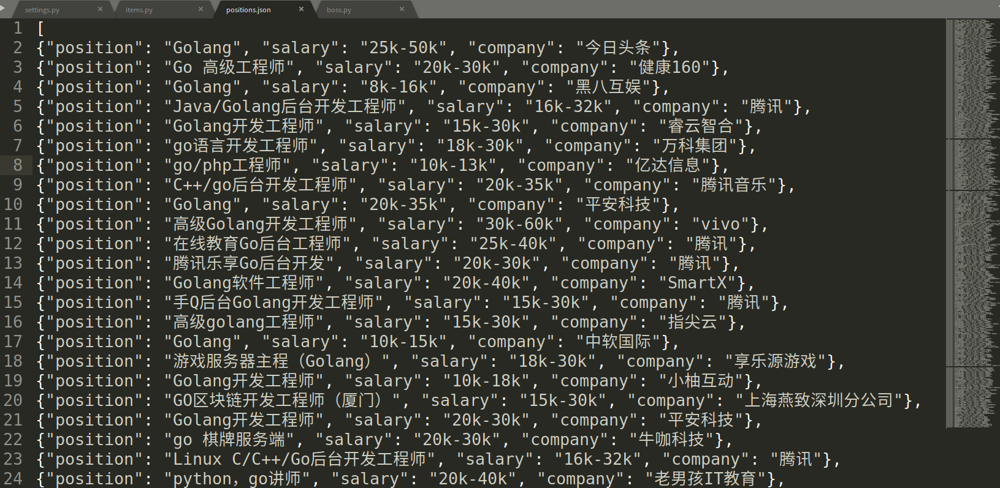

## Scrapy使用
爬取后端开发职位


### 开发过程
- 生成项目
    ```
    scrapy startproject mySpider
    ```
- 配置`mySpider/settings.py`
    ```
    USER_AGENT 
    ROBOTSTXT_OBEY //不遵守robots文件，不然有些服务器不让爬
    CONCURRENT_REQUESTS 并发请求数
    DOWNLOAD_DELAY 
    FEED_EXPORT_ENCODING //返回数据编码
    
    配置代理IP和UA
    ……
    ```
- 编写`mySpider/items.py`，定义提取的item
- 编写`mySpider/spiders/boss.py`，分析html内容，使用xpath提取数据
    
    可以事先使用`scrapy genspider boss "zhipin.com"`生成文件框架

### 运行
- 结果写入json文件
    ```
    scrapy crawl boss -o positions.json
    ```
- （部分）爬取结果
